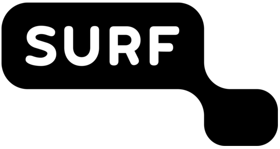
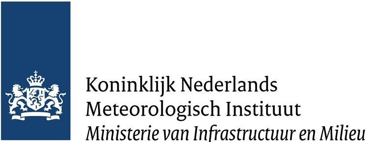
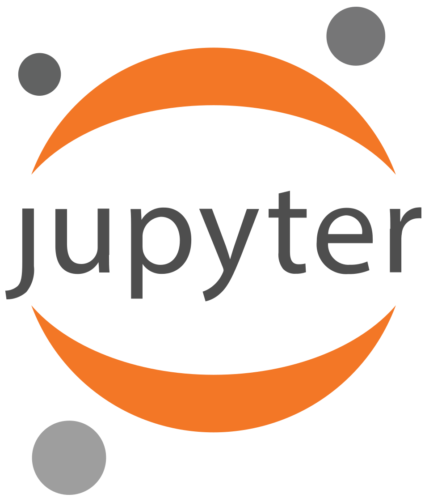

## Cloud-native

- More than just "put it in a bucket".
- Formats designed for local filesystems often perform poorly in the cloud.
- Key difference: data is accessed via HTTP range requests → latency, not throughput, is often the bottleneck.

## This workshop

Starting from real-world datasets, we'll try to answer:

- *How do I produce cloud-optimized datasets well?*
- *How do I know they are actually better?*

## In practice

::: {.incremental}
* Explore two raster datasets and one tensor dataset in their original formats.
* Convert them to cloud-optimized formats (COG and Zarr) with different configurations, and upload them to an object store.
* Benchmark them against the original formats across different access patterns.
* Publish the converted datasets as a STAC catalog.
:::

## {.center .centered}

CLOUD-NES aims to investigate and promote cloud-native research data practices in the Natural and Engineering Sciences (NES).

::: {.r-hstack style="gap: 40px;"}
{height=80}

{height=80}

{height=80}

{height=80}
:::

[`cloudnes.org`](https://cloudnes.org){preview-link="false"}

::: {.footer style="max-width: 80%; left: 0; right: 0;"}
The project "CLOUD-NES" with file number ICT.001.TDCC.016 of the research programme NWO Thematic Digital Competence Centers (TDCCs) 2023-2 is financed by the Dutch Research Council (NWO).
:::

## Infrastructure for today

:::: {.columns .centered}

::: {.column .centered width="49%"}
{height=200}

Object store
:::

::: {.column .centered width="49%"}
{height=200}

JupyterHub
:::
::::
